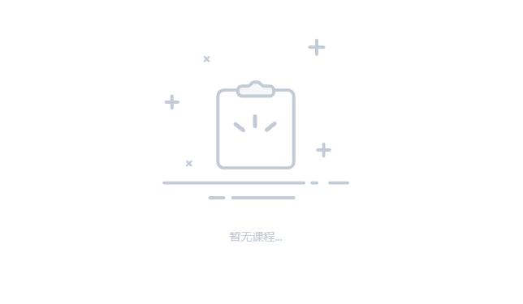
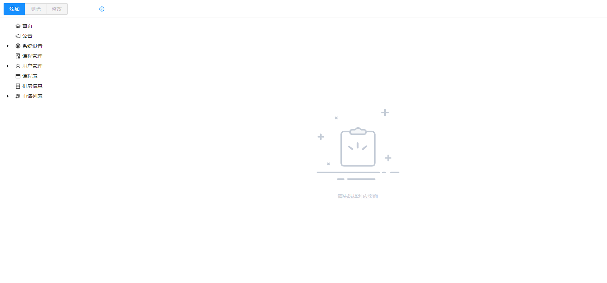

​


类似管理系统之类的页面中，经常会用到没有数据时显示对应的空状态，常规的做法是在数据块之后添加空状态元素并使用 if 或者绑定 hidden 样式实现。在开发中也可以通过指令实现自动控制空状态组件的显示隐藏，不必在每处手动添加额外的元素。本文以 Angular 框架为例。

## 一、新建 Directive 模块

Directive 能够更改 DOM 元素或组件的外观和行为，通过判断父元素传入的参数，在指令中修改父元素的 DOM 内容即能完成空状态的自动显示隐藏

```ts
// ElementRef 注入绑定该指令的元素，Input 获取组件传入的参数
import { Directive, ElementRef, Input } from "@angular/core";

@Directive({
  selector: "[empty]", // 指令名称
})
export class EmptyDirective {
  // 创建空状态节点
  node = document.createElement("div");
  // 传入的空状态提示信息
  @Input() emptyInfo = "";
  // 传入的需要校验的值--变化时触发样式修改
  @Input()
  set emptyData(data: any[]) {
    if (!data.length && !this.el.nativeElement.contains(this.node)) {
      // 源父组件中没有子元素且不含空元素组件时->添加空元素组件
      this.el.nativeElement.append(this.node);
    } else if (data.length && this.el.nativeElement.contains(this.node)) {
      // 源父组件有子元素（有数据）且包含空元素组件时->删除空元素组件
      this.el.nativeElement.removeChild(this.node);
    }
  }

  // 注入父元素
  constructor(private el: ElementRef) {}

  // 在 OnInit 生命周期中设置元素样式，确保能够获取到父元素
  ngOnInit() {
    // 设置父元素 position
    this.el.nativeElement.style.position = "relative";
    // 设置空状态组件样式
    // 用绝对定位实现样式在父元素中居中显示
    this.node.style.cssText =
      "position: absolute;color: rgb(195, 203, 214); top: 0;left: 0;right: 0;bottom: 0;z-index: 99;display: flex;flex-direction: column;justify-content: center;align-items: center;";
    // 设置内容（svg 内容已省略）
    this.node.innerHTML = `<svg style="width: 50%; max-width: 300px;"></svg> <span> ${this.emptyInfo} </span> `;
  }
}
```

## 二、使用

使用指令只需要像添加属性一样写在元素中即可,传入的 data 为该元素中循环显示的数据

```ts
<div empty [emptyData]="data" emptyInfo="没有内容...">
```

因为空状态组件没有明确的背景颜色（这里没有找到好的办法实现遮住后面的额外元素，有方法的话望告知），所以如果父元素中还有额外的元素时，不能直接这样使用，后面的其他元素还是会显示出来，可以对额外的元素添加 if 或 hidden 指令在没有数据时隐藏实现效果

```ts
<div empty [emptyData]="commentsData" emptyInfo="没有内容...">
    <div *ngIf="data.length"></div> <!-- 额外元素 -->
</div>
```

最终不需要手动添加空状态元素，就能实现如下的效果：

​​
