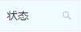
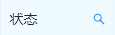

---

title: ngZorro 表格多列联动筛选实现
author: Xavi
date: "2021-07-07"
---​

[NG-Zorro](https://ng.ant.design/components/table/zh#components-table-demo-custom-filter-panel)官方文档中只介绍了纯文本搜索的联动筛选以及单列的自定义筛选，业务需求中要用到不同状态的联动搜索（在前一个筛选条件基础上进行筛选），包括文本值搜索、日期搜索、多选框搜索。这里做一个简单的记录，写得比较复杂，如果有简单的方法望告知。

## 一、定义表格

需要筛选的字段中添加`<nz-filter-trigger>`，设置 visible 变量

i 标签为筛选器的图标，可自行定义

nzActive 表示该筛选器处于激活状态（已筛选）的条件

（未激活）（激活）

nzDropdownMenu 表示筛选菜单的模板，定义见二

```html
<thead>
  <tr>
    <th>上级单位</th>
    <th>
      单位
      <nz-filter-trigger
        [(nzVisible)]="table.filter.fields[0].visible"
        [nzActive]="
			table.filter.fields[0].searchValue.length > 0
			"
        [nzDropdownMenu]="menu1"
      >
        <i nz-icon nzType="search"> </i>
      </nz-filter-trigger>
    </th>
    <th>帐号</th>
    <th>
      业务名称
      <nz-filter-trigger
        [(nzVisible)]="table.filter.fields[1].visible"
        [nzActive]="
			table.filter.fields[1].searchValue.length > 0
			"
        [nzDropdownMenu]="menu2"
      >
        <i nz-icon nzType="search"> </i>
      </nz-filter-trigger>
    </th>
    <th>
      办理时间
      <nz-filter-trigger
        [(nzVisible)]="table.filter.fields[2].visible"
        [nzActive]="table.filter.fields[2].searchValue"
        [nzDropdownMenu]="menu3"
      >
        <i nz-icon nzType="search"> </i>
      </nz-filter-trigger>
    </th>
    <th>
      状态
      <nz-filter-trigger
        [(nzVisible)]="table.filter.fields[3].visible"
        [nzActive]="
			table.filter.fields[3].searchValue.toString() !==
			table.filter.doneCopy.toString() &&
			(table.filter.doneCopy[0] ||
			table.filter.doneCopy[1])
			"
        [nzDropdownMenu]="menu4"
      >
        <i nz-icon nzType="search"> </i>
      </nz-filter-trigger>
    </th>
    <th>操作</th>
  </tr>
</thead>
```

## 二、定义筛选菜单模板

筛选菜单可以完全自定义，本例中分别用了文本框、日期选择框、多选框。通过自定义搜索和重置函数完成功能，本例中复用了同一函数。

```html
<!-- 单位筛选菜单 -->
<nz-dropdown-menu #menu1="nzDropdownMenu">
  <div class="ant-table-filter-dropdown">
    <div class="search-box">
      <input
        type="text"
        nz-input
        placeholder="输入关键字"
        [(ngModel)]="table.filter.fields[0].searchValue"
      />
      <button
        nz-button
        nzSize="small"
        nzType="primary"
        (click)="table.filter.search(0)"
        class="search-button"
      >
        搜索
      </button>
      <button nz-button nzSize="small" (click)="table.filter.reset(0)">
        重置
      </button>
    </div>
  </div>
</nz-dropdown-menu>
<!-- 业务名称筛选菜单 -->
<nz-dropdown-menu #menu2="nzDropdownMenu">
  <div class="ant-table-filter-dropdown">
    <div class="search-box">
      <input
        type="text"
        nz-input
        placeholder="输入关键字"
        [(ngModel)]="table.filter.fields[1].searchValue"
      />
      <button
        nz-button
        nzSize="small"
        nzType="primary"
        (click)="table.filter.search(1)"
        class="search-button"
      >
        搜索
      </button>
      <button nz-button nzSize="small" (click)="table.filter.reset(1)">
        重置
      </button>
    </div>
  </div>
</nz-dropdown-menu>
<!-- 时间筛选菜单 -->
<nz-dropdown-menu #menu3="nzDropdownMenu">
  <div class="ant-table-filter-dropdown">
    <div class="search-box">
      <nz-date-picker [(ngModel)]="table.filter.fields[2].searchValue">
      </nz-date-picker>
      <button
        nz-button
        nzSize="small"
        nzType="primary"
        (click)="table.filter.search(2)"
        class="search-button"
      >
        搜索
      </button>
      <button nz-button nzSize="small" (click)="table.filter.reset(2)">
        重置
      </button>
    </div>
  </div>
</nz-dropdown-menu>
<!-- 状态筛选菜单 -->
<nz-dropdown-menu #menu4="nzDropdownMenu">
  <div class="ant-table-filter-dropdown">
    <div class="search-box">
      <div class="labels">
        <label
          nz-checkbox
          nzValue="1"
          [ngModel]="table.filter.fields[3].searchValue[0]"
          [disabled]="!table.completed"
          (ngModelChange)="
				table.filter.fields[3].changeFn(true, $event)
				"
        >
          已完成
        </label>
        <label
          nz-checkbox
          nzValue="2"
          [ngModel]="table.filter.fields[3].searchValue[1]"
          [disabled]="!table.undone"
          (ngModelChange)="
				table.filter.fields[3].changeFn(false, $event)
				"
        >
          未完成
        </label>
      </div>
      <button
        nz-button
        nzSize="small"
        nzType="primary"
        (click)="table.filter.search(3)"
        class="search-button"
      >
        搜索
      </button>
      <button nz-button nzSize="small" (click)="table.filter.reset(3)">
        重置
      </button>
    </div>
  </div>
</nz-dropdown-menu>
```

## 三、定义相关值与函数

```ts
table.filter = {
    /**
     * doneCopy在本例中用于记录状态筛选器的初始值
     * 状态值与初始值不一样则标记状态筛选器为激活状态，且参与筛选
     */
	doneCopy: [],
	filterData: [], // 筛选后数据
	// 筛选字段相关
	fields: [{
		visible: false, // 筛选菜单是否显示
		searchValue: '', // 筛选值
		field: 'orgName', // 字段名
        /**
         * 筛选对比函数
         * @param item 为每一条记录，用于筛选表格数据时进行比对
         */
		searchFn: function(item) {
            // 常规函数的this，向上查找即为该字段对象本身
			return item[this.field].indexOf(this.searchValue) !== -1;
		},
	},
	{
		visible: false,
		searchValue: '',
		field: 'title',
		searchFn: function(item) {
			return item[this.field].indexOf(this.searchValue) !== -1;
		},
	},
	{
		visible: false,
		searchValue: null,
		field: 'startTime',
		searchFn: function(item) {
            // 日期使用toDateString()直接比较是否是同一天
			return (new Date(item[this.field]).toDateString() === this.searchValue.toDateString());
		},
	},
	{
		visible: false,
		searchValue: [],
		field: 'state',
		searchFn: function(item) {
			let flag;
            // 复选框均未选中则结果为空，定义flag为不存在的值
			if (! (this.searchValue[0] || this.searchValue[1])) flag = -1;
            // 有复选框选中则判断其值（超过两个复选框的情况需要另外判断）
			else flag = this.searchValue[0] ? 1 : 0;
			if (flag === 1 || flag === -1) return item[this.field] === flag;
			else return item[this.field] !== 1;
		},
        /**
         * 改变复选框状态值
         * @param flag 为HTML中传入，代表对应的复选框
         */
		changeFn: function(flag, e) {
			if (flag) this.searchValue[0] = e;
			else this.searchValue[1] = e;
		},
	},
	],
	// 重置某一字段筛选条件
	reset: i = >{
		switch (i) {
		case 0:
		case 1:
			this.table.filter.fields[i].searchValue = '';
			break;
		case 2:
			this.table.filter.fields[i].searchValue = null;
			break;
		case 3:
			this.table.filter.fields[i].searchValue = [...this.table.filter.doneCopy];
			break;
		}

		this.table.filter.search(i);
	},
	// 筛选函数
	search: i = >{
		this.table.filter.fields[i].visible = false;
		this.table.filter.filterData = this.table.tableData.filter(item = >{
			// 对每一条记录循环执行各字段筛选函数，实现多字段联动筛选
			for (const field of this.table.filter.fields) {
				// 数组项（状态复选框），与初始选择状态条件不一致才执行
				if ((Array.isArray(field.searchValue) && field.searchValue.toString() !== this.table.filter.doneCopy.toString()) || (!Array.isArray(field.searchValue) && field.searchValue)) {
					if (!field.searchFn(item)) return false;
				}
			}
            // 任意一个存在的条件筛选不通过则return false结束当条记录的判断，均满足则return true
			return true;
		});
	},
}
```
